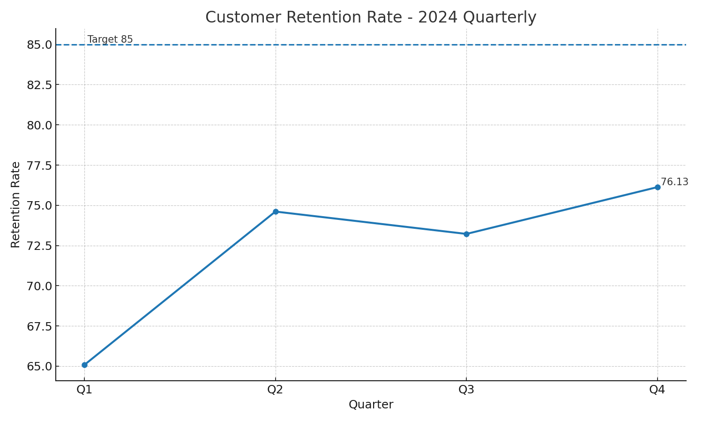

# Customer Retention 2024 – Quarterly Analysis (LLM-Assisted)

This Pull Request adds code and a visualization analyzing 2024 quarterly **customer retention rate** vs. an **industry target** benchmark.

**Verification email (as required): 24ds2000041@ds.study.iitm.ac.in**

## Dataset
- Q1: 65.08
- Q2: 74.61
- Q3: 73.22
- Q4: 76.13
- **Average: 72.26**
- **Industry Target:** 85

## Files in this PR
- `data.csv` — quarterly retention data
- `analysis.py` — Python script that loads, analyzes, and visualizes the data
- `chart.png` — trend chart with industry target benchmark (auto-generated by `analysis.py`)

## How to run
```bash
python analysis.py
```

## Visualization
The chart shows quarterly retention with a dashed line for the **85** target and a labeled latest quarter.



## Key Findings
1. **Upward trajectory**: Retention increased from **65.08** in Q1 to **76.13** in Q4 (+11.05 points).  
2. **Average under target**: The **average** retention in 2024 is **72.26**, which is **12.74** points below the **85** target.  
3. **Latest still short**: Q4 sits at **76.13**, leaving an **8.87**-point gap to the target.  
4. **Stability with minor soft patch**: Q2 to Q3 shows a small decrease (**74.61 → 73.22**), but Q4 recovered to a new high for the year.

## Business Implications
- Retention improvements are material but **insufficient** to reach industry parity. Below-target retention typically correlates with **higher acquisition costs**, **lower LTV**, and increased **churn risk** in sensitive cohorts.
- The **improving trend** suggests existing initiatives are partially effective; scaling and focusing them could accelerate progress.
- A gap of **8.87** points in Q4 implies meaningful **revenue leakage** versus best-in-class peers if left unaddressed.

## Recommendations to Reach 85
The solution direction: **implement targeted retention campaigns**. Concretely:
1. **Cohort-based retention playbooks**: Segment by tenure, product usage, and region; trigger targeted lifecycle interventions (e.g., renewal nudges, “save” offers for risk cohorts).
2. **Proactive health scoring & alerts**: Use product signals (usage drop, support tickets) to flag at-risk customers and activate outreach within **24–48h**.
3. **Value reinforcement**: Quarterly business reviews (QBRs) for mid/high-value segments; highlight realized ROI to reduce churn intent.
4. **Winback programs**: Time-bound reactivation offers for recently churned accounts with friction removal (data restore, concierge setup).
5. **Pricing & contract levers**: Multi-year incentives with early-renewal perks; pilot success-based add-ons for hesitant segments.
6. **Experimentation cadence**: A/B test incentives, channels, and messaging; target **+2–3 points** per quarter to hit **≥85** within ~4 quarters if compounding.

## LLM Usage
- Drafted analysis plan, code, and narrative using an LLM with code-generation capabilities (e.g., ChatGPT Codex / Claude Code / Copilot).
- Human-reviewed metrics: **Average = 72.26**; target benchmarking and gaps verified.

---
_Prepared for PR review. Run `analysis.py` to regenerate `chart.png`._
